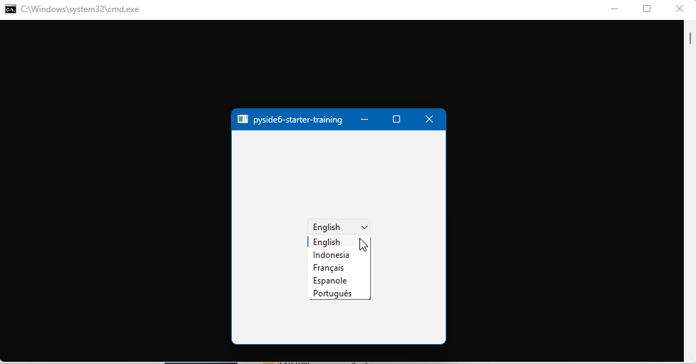

# PySide6 Multi Bahasa
kode implementasi multi bahasa untuk pyside6

## Penggunaan
- install uv `powershell -c "irm https://astral.sh/uv/install.ps1 | more"`
- jalankan uv: `uv sync`
- jalankan program: `uv run main.py`

## Pembelajaran
untuk bisa membuat fitur multi bahasa ada 3 alat yang harus digunakan serta penulisan kode yang harus disesuaikan

berikut alat yang digunakan:
- pyside6-lupdate
- pyside6-linguist
- pyside6-lrelease

berikut penulisan kode yang harus disesuaikan:
```
def retranslate_ui(self):
    self.setWindowTitle(self.tr('pyside6-starter-training'))
    self.button.setText(self.tr('Click Me'))
```

untuk semua kata yang ingin ditranslate, maka harus ditaruh didalam fungsi retranslate_ui().
bertujuan agar mengubah bahasa bisa dilakukan dengan mudah

selanjutnya yaitu membungkus kata menggunakan self.tr() ini bertujuan agar bisa dideteksi oleh alat pyside6-lupdate dalam pembuatan file .ts

jadi alurnya yaitu generate file .ts dulu menggunakan pyside6-lupdate kemudian translate katanya menggunakan alat pyside6-linguist (ini aplikasi gui), dan terakhir baru dikonversi menjadi file .qm menggunakan pyside6-lrelease

## Contoh Kode 
berikut contoh kode yang digunakan untuk menggenerate, mengedit, lalu menconvertnya

convert menjadi .ts
```
uv run pyside6-lupdate main.py ./src/main_view.py -ts ./src/translations/app_id.ts -ts ./src/translations/app_fr.ts ./src/translations/app_es.ts
```

mengeditnya dengan aplikasi gui linguist
```
uv run pyside6-linguist ./src/translations/app_id.ts
```

terakhir konversi file .ts ke .qm
```
uv run pyside6-lrelease ./src/translations/app_id.ts -qm ./src/translations/app_id.qm
```

## Pengoptimalan
saya membuat skrip untuk otomatisasi pembuatan file.ts dan konversinya menjadi .ts didalam folder `build` 

tinggal jalankan saja `translations_ts.bat` dan `translations_qm.bat` 

maka file translate dengan mudah dibuat tanpa harus mengetik perintah

## Preview
